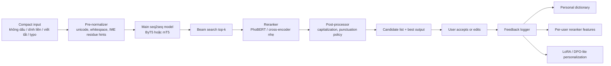
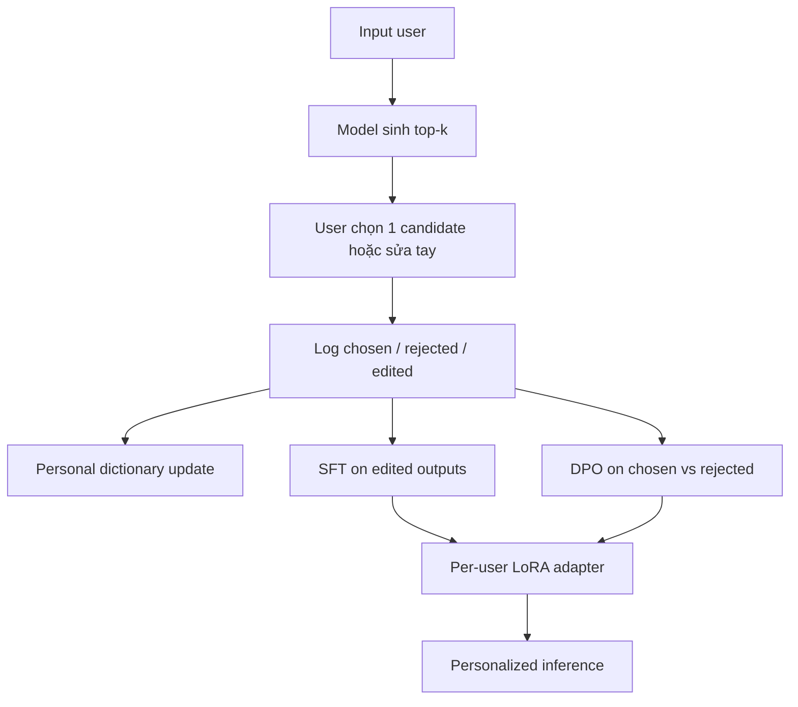
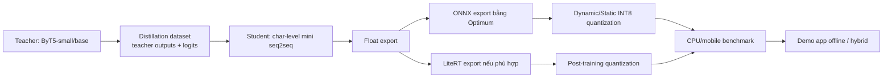
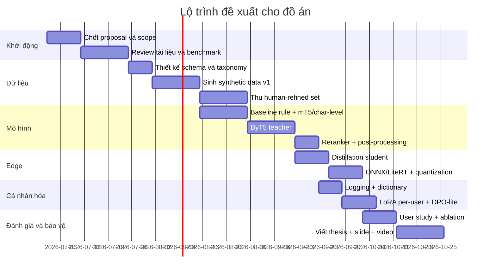

# Báo cáo phân tích và kế hoạch dự án tốt nghiệp

## Tóm tắt điều hành

Đề tài **“Personalized and Edge-efficient Vietnamese Compact Writing Restoration with Keyboard-aware Typo Correction”** có cơ sở học thuật tốt để trở thành một đồ án tốt nghiệp mạnh theo hướng AI/DL/NLP, vì nó không chỉ giải một bài toán quen thuộc là **khôi phục dấu tiếng Việt**, mà hợp nhất nhiều tiểu bài toán vốn đang được nghiên cứu rời rạc: phục hồi dấu tiếng Việt, chuẩn hóa ngôn ngữ phi chuẩn, sửa lỗi chính tả/gõ phím, khôi phục viết hoa và dấu câu, cá nhân hóa theo người dùng, và nén mô hình để chạy trên thiết bị biên. Các nguồn chính cho thấy: bài toán khôi phục dấu tiếng Việt đã có baseline mạnh từ khá sớm; lexical normalization tiếng Việt vẫn còn khó; các mô hình byte-level như ByT5 đặc biệt bền vững với văn bản nhiễu; các kỹ thuật PEFT như LoRA, distillation và quantization đã đủ trưởng thành để đưa một hệ seq2seq xuống edge; và DPO là một lựa chọn nhẹ hơn RLHF để học từ preference/correction của người dùng. citeturn8search0turn14view0turn14view1turn9search1turn17view0turn19search0turn15view0turn15view1turn12view3turn2search1

Nhìn từ khoảng trống nghiên cứu, các công trình Việt ngữ hiện có thường tập trung vào **một lát cắt hẹp**: khôi phục dấu, hoặc spelling correction, hoặc punctuation/capitalization, hoặc lexical normalization. Ví dụ, nghiên cứu về diacritic restoration năm 2017 chủ yếu xem bài toán như dịch máy từ văn bản không dấu sang văn bản có dấu; ViLexNorm 2024 giới thiệu corpus chuẩn hóa từ vựng cho tiếng Việt mạng xã hội; BARTpho 2021 chứng minh mô hình seq2seq đơn ngữ Việt hiệu quả cho punctuation/capitalization; VSEC 2021 và nghiên cứu BERT+Transformer năm 2024 đi sâu vào spelling correction. Tuy nhiên, từ các nguồn được khảo sát trong báo cáo này, **chưa thấy một thiết kế hệ thống hoàn chỉnh** đồng thời xử lý văn bản tiếng Việt nhập rút gọn, lỗi gõ gần-phím, cá nhân hóa theo người dùng, và triển khai edge-first. Đây là khe hở đủ rõ để biện minh cho tính mới ở cấp đồ án tốt nghiệp, nếu phạm vi được khóa đúng và quy trình thực nghiệm đủ chặt. citeturn8search0turn18view0turn18view1turn14view0turn26view0turn24view1

Khuyến nghị cốt lõi của báo cáo là xây dựng dự án theo kiến trúc **teacher–student**: dùng **ByT5-small hoặc ByT5-base** làm mô hình nghiên cứu chính vì ưu thế trên dữ liệu nhiễu và text ngắn–trung bình; dùng **mT5-small** làm baseline pretrained mạnh; dùng một **char-level Transformer** hoặc một student seq2seq nhỏ làm bản deploy edge sau distillation; dùng **PhoBERT** hoặc một cross-encoder nhẹ để rerank ứng viên; và dùng **LoRA per-user + personal dictionary + DPO-lite** để cá nhân hóa. Cách dựng này bám sát bằng chứng từ các nguồn gốc về ByT5, mT5, PhoBERT, LoRA, DPO, ONNX Runtime và LiteRT. citeturn12view1turn11view0turn12view0turn13view1turn1search0turn17view1turn2search0turn23search0turn15view0turn15view1turn16view0turn15view2

Nếu thực hiện đúng kế hoạch trong báo cáo này, đồ án có thể có **ba lớp đóng góp** rõ ràng. Lớp đầu là **đóng góp bài toán và dữ liệu**: định nghĩa compact writing restoration cho tiếng Việt, xây noise taxonomy, tạo synthetic data và human-refined test set. Lớp thứ hai là **đóng góp mô hình và hệ thống**: typo-aware seq2seq, distillation, quantization, reranking, personalization. Lớp thứ ba là **đóng góp đánh giá thực dụng**: ngoài CER/WER và accuracy còn có keystroke saving rate, correction effort, latency, RAM và user study. Đây là dạng cấu trúc rất phù hợp với tiêu chí của một đồ án AI Researcher vì vừa có novelty, vừa có benchmark, vừa có demo dùng được. citeturn14view0turn26view0turn15view1turn15view0turn17view0turn23search0

Bảng dưới đây tóm tắt quyết định định vị đề tài.

| Thành phần | Khuyến nghị |
|---|---|
| Định vị học thuật | **Không** gọi đề tài là “thêm dấu tiếng Việt”; **nên** gọi là *Vietnamese Compact Writing Restoration* |
| Mục tiêu đầu ra | Câu tiếng Việt hoàn chỉnh: dấu, khoảng trắng, dấu câu, viết hoa, mở rộng viết tắt, sửa typo |
| Mô hình nghiên cứu chính | **ByT5-small/base** |
| Baseline bắt buộc | Rule-based + n-gram/LM + mT5-small + char-level Transformer |
| Mô hình deploy edge | Student char-level/mini-seq2seq sau distillation + quantization |
| Cá nhân hóa | Personal dictionary → reranker → LoRA per-user → DPO-lite |
| Đánh giá bắt buộc | NLP metrics + typo metrics + edge metrics + user-study metrics |
| Đầu ra bảo vệ | Báo cáo + benchmark + demo + video + ablation + mô tả quyền riêng tư |

## Bài toán, câu hỏi nghiên cứu và khoảng trống nghiên cứu

Bản chất của đề tài là chuyển từ một cách nhìn hẹp — “khôi phục dấu tiếng Việt” — sang một cách nhìn rộng hơn, thực dụng hơn: **khôi phục câu tiếng Việt chuẩn từ văn bản rút gọn, nhiễu và thiếu chuẩn**. Hệ thống đích không chỉ nhận chuỗi không dấu, mà còn phải chịu được tình huống mất khoảng trắng, viết tắt kiểu chat/content, dấu câu bị bỏ, ký tự thừa/thiếu do gõ nhanh, lỗi Telex/VNI, và lỗi bấm nhầm ký tự ở các phím gần nhau. Việc xây bài toán theo dạng text-to-text là nhất quán với họ mô hình T5/mT5/ByT5, vốn đều được thiết kế theo khung text-to-text thống nhất. citeturn9search4turn12view0turn12view1

Trong văn liệu tiếng Việt, **diacritic restoration** đã có lịch sử nghiên cứu tương đối dài. Bài của Pham và cộng sự xem đây như bài toán machine translation từ văn bản không dấu sang văn bản có dấu, và báo cáo accuracy khoảng 97.32% cho phrase-based và 96.15% cho neural-based method trên bộ dữ liệu lớn. Điều này là tín hiệu quan trọng: nếu đồ án chỉ dừng ở phục hồi dấu, tính mới sẽ yếu. citeturn8search0

Ở chiều ngược lại, **lexical normalization** cho tiếng Việt mạng xã hội vẫn còn rất khó. ViLexNorm được giới thiệu như corpus đầu tiên cho lexical normalization tiếng Việt, gồm hơn 10.000 cặp câu gán nhãn thủ công; hệ tốt nhất trong bài chỉ đạt 57.74% ERR với baseline Leave-As-Is trong bối cảnh đánh giá mà tác giả nêu. Điều đó cho thấy thành phần “phi chuẩn hóa” của tiếng Việt — viết tắt, dạng mạng xã hội, biến thể chính tả — vẫn còn dư địa nghiên cứu lớn. citeturn14view0turn14view1turn14view2

Song song, đã có các hướng nghiên cứu riêng cho các bài toán lân cận. BARTpho là seq2seq monolingual đầu tiên quy mô lớn cho tiếng Việt và được báo cáo hiệu quả hơn mBART trên summarization, capitalization và punctuation restoration. VSEC 2021 đưa ra một mô hình Transformer-based cho spelling correction, thử trên 11.202 lỗi do con người tạo trong 9.341 câu. Nghiên cứu năm 2024 kết hợp BERT với Transformer cho Vietnamese spelling correction, nhấn mạnh các loại lỗi thực tế như **Region, FatFinger, Telex**, và báo cáo BLEU 0.8624 cho biến thể tốt nhất của họ. Khi ghép các mảnh này lại, có thể suy ra hệ compact writing restoration nên được xem như **một bài toán tích hợp** hơn là một tác vụ đơn lẻ. citeturn18view0turn18view1turn26view0turn26view1turn24view1

Về mặt mô hình tiền huấn luyện, **mT5** là một text-to-text model đa ngữ huấn luyện trên 101 ngôn ngữ, có 5 kích thước từ Small đến XXL. Tuy nhiên, chính bài báo mT5 cũng ghi nhận hiện tượng **accidental translation**, đặc biệt ở các biến thể Small và Base trong một số thiết lập zero-shot, cho thấy khi dùng mT5 cho nhiệm vụ sinh chuỗi tiếng Việt, cần có ràng buộc giải mã hoặc dữ liệu fine-tune đủ “đơn ngữ”. **ByT5** đi theo hướng byte-level, bỏ SentencePiece và xử lý trực tiếp UTF-8 bytes; bài báo gốc và repo chính thức đều nhấn mạnh ưu thế về độ bền đối với văn bản nhiễu, lỗi chính tả, dạng viết và phát âm nhạy cảm. Một nghiên cứu TACL 2024 so sánh ByT5 với mT5 cũng kết luận byte-level mô hình hóa hữu ích hơn khi dữ liệu fine-tune hạn chế, nhưng có trade-off về hiệu năng thời gian chạy, khiến nó phù hợp hơn cho những tình huống không quá time-critical. Điều này rất khớp với đề tài: ByT5 thích hợp làm **teacher nghiên cứu**, còn student nhỏ hơn sẽ gánh phần edge deployment. citeturn12view0turn12view1turn9search1turn11view0

Đối với thành phần tiếng Việt đặc thù, **PhoBERT** là monolingual LM cho tiếng Việt được báo cáo vượt XLM-R trên nhiều tác vụ Việt ngữ; **VnCoreNLP** vẫn là toolkit mạnh cho word segmentation và các annotation cơ bản; **ViT5** và **BARTpho** là những encoder-decoder đơn ngữ Việt đáng giá làm baseline hoặc teacher phụ. Điều này cho phép dự án không chỉ dựa vào mô hình multilingual, mà có thể tận dụng những khối tiếng Việt hóa sâu làm reranker hoặc normalization assistant. citeturn13view1turn13view2turn13view3turn18view2

Từ đối chiếu trên, báo cáo này xác định **khoảng trống nghiên cứu** như sau: chưa có một cấu trúc dự án Việt ngữ được mô tả đầy đủ trong các nguồn khảo sát tại đây mà đồng thời kết hợp **compact input restoration**, **keyboard-aware typo correction**, **personalization per-user** và **edge-first deployment** trong một pipeline thống nhất. Đây là một **suy luận** từ việc ghép các công trình hiện có, chứ không phải khẳng định tuyệt đối rằng “chưa từng có ai làm”; nhưng ở mức làm đồ án tốt nghiệp, lập luận này là đủ chặt nếu sinh viên chứng minh được benchmark, dataset và ablation của riêng mình. citeturn8search0turn14view0turn18view0turn26view0turn24view1turn11view0turn15view0

### Câu hỏi nghiên cứu đề xuất

| Mã | Câu hỏi nghiên cứu | Dạng kiểm chứng |
|---|---|---|
| RQ1 | Liệu có thể khôi phục chính xác câu tiếng Việt chuẩn từ input rút gọn gồm các nhiễu đồng thời: không dấu, dính liền, viết tắt, và typo gần-phím? | So sánh EM, CER, WER, Diacritic Accuracy, Segmentation F1 |
| RQ2 | Với dữ liệu nhiễu cấp ký tự/byte, ByT5 có vượt mT5 và char-level Transformer trên tiếng Việt hay không? | Benchmark có cùng dữ liệu, cùng giao thức |
| RQ3 | Distillation + quantization có giữ được chất lượng đủ tốt để chạy trên edge trong giới hạn latency/RAM chấp nhận được hay không? | Edge benchmark trên CPU/mobile |
| RQ4 | Personal dictionary, reranker cá nhân và LoRA per-user có tạo ra gain đo được trên top-k hit, correction effort và acceptance rate hay không? | A/B test base model vs personalized model |
| RQ5 | DPO-lite từ dữ liệu chọn/sửa của người dùng có giúp hơn SFT thuần trên user logs không? | So sánh giữa SFT-user và DPO-user |

### Định nghĩa bài toán

Ký hiệu đầu vào là chuỗi nhiễu \(x\), và đầu ra là câu tiếng Việt chuẩn \(y\).

- \(x\): có thể chứa bỏ dấu, bỏ khoảng trắng, viết tắt, lỗi bấm gần-phím, di sót Telex/VNI, và thiếu dấu câu.
- \(y\): câu tiếng Việt chuẩn hóa hoàn chỉnh, gồm dấu, khoảng trắng/tách từ phù hợp, dấu câu, viết hoa, và mở rộng các shorthand cần thiết.

Đây là một bài toán **conditional generation** theo kiểu text-to-text, với đầu ra có thể được sinh theo beam search kèm top-k candidates để người dùng chấp nhận hoặc chỉnh sửa. Cách đặt này tương thích trực tiếp với mT5/ByT5/ViT5/BARTpho. citeturn12view0turn12view1turn13view3turn18view2

### So sánh nhanh với các hướng liên quan

| Hướng | Phạm vi | Điểm mạnh | Giới hạn với đề tài này | Nguồn |
|---|---|---|---|---|
| Vietnamese diacritic restoration | Không dấu → có dấu | Baseline mạnh, dễ benchmark | Không xử lý dính liền, viết tắt, typo, personalization | citeturn8search0turn8search5 |
| Lexical normalization | Phi chuẩn → chuẩn | Gần với social text | Chưa tập trung edge và per-user input method | citeturn14view0turn14view1 |
| Spelling correction | Sửa lỗi chính tả/gõ phím | Phản ánh lỗi thực tế | Không bao phủ compact writing đầy đủ | citeturn26view0turn24view1 |
| Punctuation/capitalization restoration | Khôi phục dấu câu, viết hoa | Thực dụng cho văn bản | Không xử lý typo và compact input | citeturn18view0turn18view1 |
| Byte-level seq2seq | Chịu nhiễu mạnh | Hợp với no-space/noisy text | Chậm hơn subword khi sinh chuỗi | citeturn12view1turn11view0 |
| PEFT/LoRA + DPO | Cá nhân hóa rẻ | Phù hợp per-user adaptation | Cần cẩn thận về log dữ liệu và privacy | citeturn1search0turn17view0turn2search0turn23search0turn7search16 |

## Thiết kế dữ liệu, taxonomy nhiễu và giao thức thu thập

Phần dữ liệu là **trung tâm** của đề tài. Trong các công trình liên quan, sức mạnh của mô hình thường gắn rất chặt với cách thiết kế noise và bộ test thực. VSEC 2021 nhấn mạnh việc huấn luyện trên synthetic errors nhưng đánh giá trên realistic dataset có lỗi do người thật tạo; nghiên cứu spelling correction năm 2024 cũng phân loại lỗi thực tế như Region, FatFinger và Telex. Vì vậy, dự án nên tách dữ liệu thành **ba lớp**: dữ liệu chuẩn nguồn, synthetic noisy pairs, và human-refined/user-collected pairs. citeturn26view0turn24view1

### Schema dữ liệu đề xuất

| Trường | Kiểu | Mô tả |
|---|---|---|
| `sample_id` | string | ID duy nhất |
| `domain` | enum | `content`, `social`, `email`, `education`, `admin`, `search-query` |
| `source_type` | enum | `synthetic`, `human_refined`, `user_log` |
| `standard_output` | string | Câu tiếng Việt chuẩn |
| `compact_input` | string | Câu rút gọn dùng để train/infer |
| `noise_tags` | array<string> | Danh sách loại nhiễu đã áp vào |
| `difficulty` | enum | `easy`, `medium`, `hard` |
| `abbr_profile` | enum | `none`, `common`, `heavy`, `user_specific` |
| `keyboard_layout` | enum | `qwerty_telex`, `qwerty_vni`, `mobile_qwerty` |
| `typo_positions` | array<int> | Vị trí ký tự bị lỗi |
| `typo_ops` | array<string> | `neighbor_sub`, `delete`, `insert`, `transpose`, `repeat`, `telex_residue` |
| `candidate_list` | optional array<string> | Top-k candidates nếu thu log inference |
| `user_id_hash` | optional string | Chỉ dùng khi có consent, phải băm |
| `consent_scope` | optional enum | `research_only`, `personalization_only`, `none` |
| `created_at` | timestamp | Thời gian tạo mẫu |

Về nguồn câu chuẩn, có thể dùng các corpora/bài viết tiếng Việt sạch thuộc các miền mà dự án nhắm tới như content writing, mạng xã hội đã chuẩn hóa, email công việc, mô tả sản phẩm, và một phần câu thoại ngắn. Lý do nên ưu tiên các câu ngắn–trung bình là vì ByT5 được khuyến nghị đặc biệt phù hợp cho các chuỗi ngắn đến trung bình, đồng thời đây cũng là vùng sử dụng điển hình của một input method. citeturn12view1

### Taxonomy nhiễu đề xuất

Bảng sau phân tách rõ **nhiễu mà đề tài phải mô hình hóa**. Đây là đóng góp quan trọng vì các nguồn hiện có chủ yếu theo từng nhánh, chưa ghép thành một taxonomy thống nhất cho compact writing tiếng Việt. Sự phân loại này được xây dựng dựa trên đặc tính gõ Telex/VNI chính thức mà Microsoft mô tả, phổ biến thực tế của UniKey, và nhóm lỗi spelling thực tế được nhắc trong nghiên cứu 2024. citeturn10view0turn10view1turn24view1

| Nhóm nhiễu | Mô tả | Ví dụ input nhiễu | Ví dụ output chuẩn |
|---|---|---|---|
| Bỏ dấu | Xóa toàn bộ dấu tiếng Việt | `toi dang viet bai` | `Tôi đang viết bài.` |
| Bỏ khoảng trắng | Nối syllable/từ/cụm | `toidangvietbai` | `Tôi đang viết bài.` |
| Viết tắt phổ biến | Rút ngắn từ/cụm phổ biến | `sv nam 4`, `ko`, `dc` | `sinh viên năm 4`, `không`, `được` |
| Viết tắt nghề/ngữ cảnh | Từ miền content/marketing | `cta`, `kpi`, `brd` | Giữ nguyên/chuẩn hóa theo policy |
| Dấu câu bị bỏ | Không có `. , ? !` | `hom nay toi viet bai moi` | `Hôm nay tôi viết bài mới.` |
| Viết hoa bị bỏ | Toàn bộ chuyển lower case | `ha noi la thu do` | `Hà Nội là thủ đô.` |
| Typo gần-phím | Ký tự nhầm do phím lân cận | `toj`, `nhay`, `baif` | `tôi`, `nhạy`, `bài` |
| Typo do thừa/thiếu | Insertion/deletion/repeat | `toii`, `muon`→`muon`, `vieet` | `tôi`, `muốn`, `viết` |
| Telex residue | Dấu Telex còn sót | `vietj`, `ngaafy`, `ddi` | `việt`/`viết`, `ngày`, `đi` |
| VNI residue | Số gõ dấu còn sót | `a6`, `o7`, `d9` trong chuỗi | Ký tự chuẩn |
| Lỗi vùng phương ngữ | Gần âm hoặc thói quen phát âm/viết | `s/x`, `ch/tr`, `n/l` | Tùy policy, ưu tiên câu chuẩn |
| Hỗn hợp | Nhiều nhiễu cùng lúc | `t muonviet 1 bai ve ai cho svnam4` | `Tôi muốn viết một bài về AI cho sinh viên năm 4.` |

### Luật sinh lỗi keyboard-neighbor

Đây là phần nên làm **có chủ đích**, không sinh lỗi ngẫu nhiên hoàn toàn. Nghiên cứu năm 2024 nói rõ lớp lỗi **FatFinger** là một nhóm lỗi thực tế quan trọng; Microsoft cũng mô tả quy tắc Telex/VNI chuẩn, nên có cơ sở để thiết kế bộ sinh lỗi theo bàn phím QWERTY và lối gõ Việt trên QWERTY. citeturn24view1turn10view1

Báo cáo đề xuất xây một **đồ thị lân cận phím** trên QWERTY cho desktop và mobile. Với desktop, mỗi ký tự chữ cái sẽ có tập lân cận cục bộ; với mobile có thể mở rộng biên lân cận thêm một vòng do hitbox cảm ứng rộng hơn. Ví dụ:

| Phím đúng | Lân cận desktop đề xuất | Lân cận mobile đề xuất |
|---|---|---|
| `q` | `w a` | `w a s` |
| `w` | `q e a s d` | `q e a s d` |
| `e` | `w r s d f` | `w r s d f` |
| `r` | `e t d f g` | `e t d f g` |
| `t` | `r y f g h` | `r y f g h` |
| `y` | `t u g h j` | `t u g h j` |
| `u` | `y i h j k` | `y i h j k` |
| `i` | `u o j k l` | `u o j k l` |
| `o` | `i p k l` | `i p k l` |
| `a` | `q w s z` | `q w s z x` |
| `s` | `a w e d x z` | `a w e d x z` |
| `d` | `s e r f c x` | `s e r f c x v` |
| `f` | `d r t g v c` | `d r t g v c b` |
| `g` | `f t y h b v` | `f t y h b v n` |
| `h` | `g y u j n b` | `g y u j n b m` |
| `j` | `h u i k m n` | `h u i k m n` |
| `k` | `j i o l m` | `j i o l m` |
| `l` | `k o p` | `k o p` |

Từ đồ thị này, generator nên áp các phép biến đổi theo xác suất có kiểm soát:

| Phép lỗi | Ký hiệu | Xác suất trên **câu bị lỗi** | Xác suất trên **ký tự được chọn** | Ghi chú |
|---|---|---:|---:|---|
| Neighbor substitution | `SUB_NEAR` | 0.60–0.70 | 0.01–0.04 | Lỗi chủ đạo |
| Deletion | `DEL` | 0.10–0.15 | 0.003–0.01 | Gõ thiếu |
| Insertion | `INS` | 0.08–0.12 | 0.003–0.01 | Gõ dư |
| Transposition | `TRANS` | 0.05–0.10 | 0.002–0.008 | Đảo vị trí 2 ký tự gần nhau |
| Repeat | `REP` | 0.05–0.10 | 0.002–0.008 | `toii`, `vieet` |
| Telex residue | `TELEX_RES` | 0.05–0.10 | 0.002–0.012 | `dd`, `aw`, `aa`, `ow`, `uw`, `s/f/r/x/j` |
| VNI residue | `VNI_RES` | 0.01–0.03 | 0.001–0.006 | `6/7/8/9` còn sót |

Các shortcut Telex/VNI có thể lấy từ tài liệu chính thức của Microsoft: `aw→ă`, `aa→â`, `dd→đ`, `ee→ê`, `oo→ô`, `ow→ơ`, `uw→ư`, và `s/f/r/x/j` cho dấu thanh; UniKey cũng xác nhận Telex và VNI là hai phương pháp gõ thông dụng và hỗ trợ bảng gõ tắt. Các luật nên được mô hình hóa như **một nguồn tạo lỗi có ngữ cảnh**, chứ không chỉ là noise ngẫu nhiên ký tự độc lập. citeturn10view1turn10view0

### Tỷ lệ phân phối nhiễu theo độ khó

| Độ khó | Tỷ lệ câu có bỏ dấu | Tỷ lệ bỏ khoảng trắng | Tỷ lệ viết tắt | Tỷ lệ typo | Tỷ lệ bỏ dấu câu | Tỷ lệ hỗn hợp |
|---|---:|---:|---:|---:|---:|---:|
| Easy | 100% | 10% | 10% | 5% | 30% | 5% |
| Medium | 100% | 25% | 25% | 12% | 45% | 20% |
| Hard | 100% | 40% | 40% | 20% | 60% | 35% |

Đề xuất chia train theo curriculum: giai đoạn đầu dùng Easy/Medium để học ánh xạ nền; giai đoạn sau tăng dần tỷ lệ Hard, đặc biệt các câu có nhiều nhiễu chồng. Lý do là các paper về spelling correction tiếng Việt đã chỉ ra rằng khi nhiều lỗi đứng gần nhau, mô hình dễ mất ngữ cảnh; curriculum learning giúp ổn định fine-tuning hơn trên encoder-decoder sinh chuỗi. citeturn26view0turn24view1

### Phác thảo script sinh synthetic data

```python
def generate_compact_sample(clean_text, user_profile=None, difficulty="medium"):
    text = normalize_unicode(clean_text)
    text = maybe_lowercase(text, p=0.9)
    ops = []

    # 1. remove punctuation / capitalization
    text = remove_punctuation(text, p=get_p("punct", difficulty)); ops.append("punct_drop")
    text = lowercase(text)

    # 2. apply abbreviation rules
    text = apply_common_abbreviations(text, p=get_p("abbr", difficulty), user_profile=user_profile)

    # 3. remove diacritics
    text = strip_vietnamese_diacritics(text); ops.append("no_diacritic")

    # 4. merge spaces partially or fully
    text = collapse_spaces_by_span(text, p=get_p("space_merge", difficulty))

    # 5. apply keyboard-aware typos
    text = introduce_keyboard_typos(
        text,
        layout="qwerty_telex",
        rates=get_typo_rates(difficulty)
    )

    # 6. optional telex/vni residue injection
    text = inject_telex_vni_residue(text, p=get_p("ime_residue", difficulty))

    return {
        "compact_input": text,
        "standard_output": clean_text,
        "noise_tags": infer_noise_tags(ops, text),
        "difficulty": difficulty
    }
```

Để synthetic data không “quá giả”, nên có hai mức sinh. Mức đầu là **deterministic rule generation** phục vụ phủ dạng lỗi; mức hai là **stochastic constrained generation** để thay đổi xác suất và tổ hợp lỗi. Sau đó nên lọc lại bằng một whitelist/blacklist đơn giản để loại bỏ các mẫu không tự nhiên, ví dụ chuỗi quá ngắn, quá dài, hoặc méo nghĩa quá mức. Cách làm “synthetic-first, realistic-test” phù hợp với kinh nghiệm của VSEC và các nghiên cứu spelling correction tiếng Việt khác. citeturn26view0turn24view1

### Giao thức thu thập human-refined data

Để bộ test có giá trị, dự án cần ít nhất một **protocol gán nhãn thủ công**. Gợi ý giao thức như sau:

| Bước | Nội dung | Yêu cầu đạt |
|---|---|---|
| Chọn câu chuẩn | Lấy từ 5–6 domain mục tiêu | Mỗi domain tối thiểu 500–1.000 câu |
| Nhiệm vụ annotator | Viết lại câu theo cách “gõ nhanh thật” | Không ép theo rules máy móc |
| Thu metadata | Thiết bị, kiểu gõ quen dùng, domain, mức viết tắt | Bắt buộc cho phân tích lỗi |
| Gán nhãn chất lượng | Self-rating độ tự nhiên 1–5 | Loại câu rating quá thấp |
| Kiểm định chéo | 10–15% mẫu được annotator thứ hai viết lại | Dùng đo agreement về quy ước viết tắt |
| Chuẩn hóa đầu ra | Đầu ra chuẩn phải thống nhất dấu câu, viết hoa | Có guideline rõ |
| Tách tập | `dev_human`, `test_human`, `personalization_eval` | Tách theo người để tránh leakage |

Trong phần thu từ user thật sau khi có demo, nên dùng cơ chế **opt-in rõ ràng**: người dùng chọn một trong các mức “chỉ dùng để suy luận cục bộ”, “dùng để cá nhân hóa tài khoản của tôi”, hoặc “dùng thêm cho nghiên cứu đã ẩn danh”. Đây là cách làm phù hợp với tinh thần quản trị rủi ro quyền riêng tư mà NIST Privacy Framework khuyến nghị: xác định, đánh giá và truyền đạt rủi ro riêng tư dựa trên luồng dữ liệu và mục đích xử lý. citeturn7search0turn7search16

### Quy mô dữ liệu tối thiểu và khuyến nghị

| Tập dữ liệu | Mức tối thiểu | Mức tốt | Mức rất tốt |
|---|---:|---:|---:|
| Clean source sentences | 200k | 500k | 1M+ |
| Synthetic pairs | 100k | 500k | 1–2M |
| Dev human | 1k | 2k | 3k |
| Test human | 1k | 3k | 5k |
| Preference pairs cho DPO-lite | 2k | 10k | 25k+ |
| User-specific logs cho mỗi user pilot | 50–100 | 200–500 | 1k+ |

## Thiết kế mô hình, huấn luyện và cá nhân hóa

Về kiến trúc, dự án nên tách thành **ba tầng suy luận**. Tầng thứ nhất là **restoration model** sinh câu chuẩn từ compact input. Tầng thứ hai là **candidate generation + reranking** để tăng khả năng đúng ngữ cảnh và giảm overcorrection. Tầng thứ ba là **personalization layer** học thói quen gõ của từng người dùng bằng dictionary, reranking signal, và LoRA adapter. Cách modular này giúp đồ án vừa có baseline chặt, vừa có không gian nghiên cứu mở rộng. citeturn12view1turn12view0turn13view1turn17view0



### Lựa chọn mô hình

**ByT5** là ứng viên nghiên cứu chính hợp lý nhất vì hai lý do. Thứ nhất, nó bỏ hoàn toàn tokenizer con từ và làm việc trực tiếp trên bytes UTF-8, nhờ đó tự nhiên hơn với lỗi ký tự, chuỗi dính liền, và phần còn sót của Telex/VNI. Thứ hai, paper gốc và repo chính thức đều nhấn mạnh ByT5 cạnh tranh tốt với mT5 nhưng nổi trội hơn trên các nhiệm vụ nhạy với spelling/noise. Tuy nhiên, ByT5 cũng có chuỗi dài hơn và trade-off về tốc độ, nên không nhất thiết là lựa chọn cuối cùng cho edge runtime. citeturn12view1turn9search1turn11view0

**mT5-small** nên được giữ làm baseline pretrained mạnh. Nó đã được huấn luyện trên 101 ngôn ngữ và có hệ sinh thái triển khai rất tốt. Tuy nhiên, vì mT5-small/base có thể gặp accidental translation trong một số thiết lập, báo cáo khuyến nghị thêm **ràng buộc ngôn ngữ/giải mã** và một tập fine-tuning thuần tiếng Việt đủ lớn, đồng thời đưa token/prompt nhiệm vụ rõ ràng như `restore_vi:` để giảm khả năng drift ngôn ngữ. citeturn12view0

**Char-level Transformer** hoặc một encoder-decoder mini ở mức ký tự là candidate mạnh cho **student edge**. Lý do không phải vì nó sẽ vượt ByT5 về chất lượng, mà vì nó cho phép kiểm soát độ nhỏ, độ dài chuỗi, và export runtime dễ hơn. Với student này, đồ án có thể trình diễn rõ trade-off giữa chất lượng và footprint — một điểm cộng lớn khi bảo vệ. Cơ sở của nhánh này đến từ literature về distillation và thực tiễn triển khai edge rằng mô hình nhỏ hơn nhưng được huấn luyện bắt chước teacher thường giữ được phần đáng kể chất lượng với chi phí thấp hơn đáng kể. citeturn19search0turn3search1

**PhoBERT** không phải mô hình sinh chuỗi, nhưng rất đáng dùng làm **reranker** hoặc feature extractor cho personalization. Vì PhoBERT là monolingual Vietnamese LM được báo cáo vượt XLM-R trên nhiều tác vụ Việt ngữ, nó thích hợp để chấm điểm “độ Việt” và độ tự nhiên của các candidate sau beam search. citeturn13view1

Bảng khuyến nghị mô hình như sau.

| Vai trò | Mô hình | Mục đích | Ghi chú |
|---|---|---|---|
| Baseline rule-based | Dictionary + luật Telex/VNI + LM | Mốc thấp nhất | Giải thích được |
| Baseline pretrained | mT5-small | So sánh với ByT5 | Dễ fine-tune |
| Main research teacher | ByT5-small hoặc ByT5-base | Chịu nhiễu tốt | Hợp compact/noisy input |
| Vietnamese baseline phụ | ViT5-small / BARTpho | So sánh với mô hình đơn ngữ Việt | Mạnh trên generation tiếng Việt |
| Reranker | PhoBERT-base | Chọn candidate tốt nhất | Việt hóa mạnh |
| Student edge | char-level mini Transformer | Deploy CPU/mobile | Sau distillation |

### Kiến trúc loss và recipe huấn luyện

Giai đoạn nền nên dùng loss sinh chuỗi chuẩn dạng **token/byte cross-entropy**. Với teacher–student, nên dùng loss đa thành phần:

\[
\mathcal{L}_{total} = \lambda_{gold}\mathcal{L}_{CE}(y, \hat{y}_s) + \lambda_{KD} T^2 \, KL(p_t^T || p_s^T) + \lambda_{hid}\mathcal{L}_{hid}
\]

Trong đó:
- \(\mathcal{L}_{CE}\): cross-entropy giữa student output và ground truth.
- \(KL(p_t^T || p_s^T)\): knowledge distillation tại temperature \(T\).
- \(\mathcal{L}_{hid}\): tùy chọn, alignment giữa hidden states/encoder states teacher–student.

Ý tưởng teacher–student này dựa trên khung knowledge distillation cổ điển của Hinton và distillation trong NLP như DistilBERT. citeturn19search0turn3search1turn3search9

Với personalization bằng **DPO-lite**, nên dùng preference pairs \((y^+, y^-)\) thu từ “candidate user chọn” hoặc “output user sửa so với output bị bỏ”. DPO được giới thiệu như một cách tối ưu preference nhẹ hơn RLHF, bỏ mô hình reward riêng và thay bằng một objective phân loại đơn giản hơn. Ở mức đồ án, đây là hướng thực dụng hơn nhiều so với PPO/RLHF đầy đủ. citeturn2search0turn23search0turn2search1

### Lộ trình huấn luyện đề xuất

| Giai đoạn | Dữ liệu | Mục tiêu | Mô hình |
|---|---|---|---|
| Stage A | Synthetic easy/medium | Học ánh xạ nền no-diacritic/noisy → chuẩn | mT5-small, ByT5-small |
| Stage B | Synthetic full + hard | Học nhiễu chồng, typo gần-phím | ByT5-small/base |
| Stage C | Human-refined dev/train | Hiệu chỉnh theo phân phối thật | Teacher tốt nhất |
| Stage D | Distillation | Nén sang student nhỏ | Student char-level/mini-seq2seq |
| Stage E | User-specific SFT | Cá nhân hóa nhẹ | LoRA per-user |
| Stage F | Preference optimization | Học từ chosen/rejected | DPO-lite trên adapter |

### Hyperparameter khuyến nghị

Bảng này là **recipe đề xuất** của báo cáo, tham khảo cấu hình encoder-decoder thực dụng và các gợi ý từ các mô hình liên quan, không phải sao chép nguyên xi từ một paper cụ thể.

| Mục | ByT5-small | mT5-small | Student char-level |
|---|---:|---:|---:|
| Max input length | 256–384 bytes | 128–196 tokens | 256–384 chars |
| Max output length | 256–384 bytes | 128–196 tokens | 256–384 chars |
| Batch size hiệu dụng | 64–128 | 64–128 | 128–256 |
| Learning rate | 1e-4 đến 3e-4 | 1e-4 đến 2e-4 | 2e-4 đến 5e-4 |
| Warmup ratio | 3%–5% | 3%–5% | 3% |
| Label smoothing | 0.05 | 0.05 | 0.05–0.1 |
| Weight decay | 0.01 | 0.01 | 0.01 |
| Beam size | 4–8 | 4–8 | 4–6 |
| Epochs Stage A/B | 3–8 | 3–8 | 5–15 |
| Epochs personalization | 1–3 | 1–3 | 1–3 |

### Candidate generation và reranking

Beam search của seq2seq nên sinh ra **top-k candidates** thay vì chỉ một câu duy nhất. Đây là cơ sở cho cả trải nghiệm sản phẩm lẫn DPO/personalization. Điểm ứng viên có thể tính theo:

\[
Score(c) = \alpha \log P_{seq2seq}(c|x) + \beta S_{rerank}(c,x) + \gamma S_{personal}(c,u) - \delta Penalty(c)
\]

Trong đó:
- \(S_{rerank}\): điểm từ PhoBERT/cross-encoder.
- \(S_{personal}\): điểm cộng nếu candidate khớp dictionary hoặc user n-gram history.
- \(Penalty\): phạt overcorrection, phạt vi phạm danh sách từ cần giữ nguyên như tên riêng/brand/code.

Việc dựng penalty là rất quan trọng, vì nghiên cứu spelling correction 2024 cũng chỉ ra proper nouns là điểm yếu và nhắc đến nhu cầu có thêm NER hoặc thành phần quyết định “nên sửa hay không”. VnCoreNLP và PhoBERT có thể hỗ trợ phần này. citeturn24view1turn13view2turn13view1

### Chiến lược cá nhân hóa

Cá nhân hóa nên đi theo lộ trình tăng dần độ phức tạp.

| Tầng | Cơ chế | Dữ liệu cần | Độ khó triển khai | Giá trị thực tế |
|---|---|---:|---:|---|
| Personal dictionary | Map viết tắt riêng của user | 10–50 edits | Thấp | Rất cao |
| Personal prior | Thống kê phrase/domain user hay dùng | 50–200 logs | Thấp | Cao |
| Personal reranker | Cross-encoder hoặc linear rerank theo user | 100–500 logs | Trung bình | Cao |
| LoRA per-user | Adapter riêng cho từng user | 200–2.000 samples | Trung bình–khá | Rất cao |
| DPO-lite per-user | Chosen vs rejected candidates | 500–5.000 preference pairs | Khá | Cao ở người dùng nặng |

**LoRA** rất phù hợp cho per-user adapters vì chỉ fine-tune một phần rất nhỏ tham số, giúp giảm chi phí lưu trữ và compute. Hugging Face PEFT cũng nhấn mạnh PEFT cho phép tinh chỉnh mô hình lớn với số tham số trainable nhỏ, giảm mạnh chi phí compute và lưu trữ, đủ nhẹ để phù hợp với consumer hardware. citeturn1search0turn17view0turn17view1

**DPO-lite** là bước sau LoRA/SFT, không nên là điểm khởi đầu. Flow đề xuất:



Mục tiêu ở đây không phải “alignment” theo nghĩa rộng như chatbot, mà là **preference optimization cho input method**: học rằng người A thích viết “không” hơn “ko” trong một số ngữ cảnh; người B hay viết hoa tên chiến dịch; người C hay giữ các acronym tiếng Anh nguyên dạng. Điều này phù hợp với tinh thần RLHF/DPO nhưng ở quy mô nhỏ và bài bản hơn cho đồ án. citeturn2search0turn2search1turn23search0turn23search10

## Tối ưu edge, triển khai suy luận và quản trị quyền riêng tư

Tối ưu edge là điểm phân biệt quan trọng giữa một đồ án chỉ có mô hình và một đồ án đủ “sản phẩm hóa”. Tài liệu chính thức của LiteRT nhấn mạnh lợi ích của on-device machine learning gồm **độ trễ thấp, không cần Internet, hướng privacy-first và giảm công suất/footprint**; ONNX Runtime thì có tài liệu rõ cho mobile deployment và quantization Transformer. Do đó, việc bổ sung nhánh edge không chỉ là “màu mè”, mà có căn cứ kỹ thuật mạnh và rất hợp với use case gõ văn bản cá nhân. citeturn15view2turn15view3turn15view4

### Pipeline edge đề xuất



### Distillation

Distillation nên theo triết lý:
- **Teacher** được tối ưu cho chất lượng, không quá lo footprint.
- **Student** được tối ưu cho edge inference.
- Student học cả từ **ground truth** lẫn **teacher distributions**.

Lập luận này dựa vào khung distillation gốc của Hinton, và kinh nghiệm của DistilBERT cho thấy có thể giữ phần đáng kể chất lượng trong khi giảm độ lớn và tăng tốc suy luận. citeturn19search0turn3search1turn3search9

### Quantization

Tài liệu Google AI Edge cho biết post-training quantization có thể giảm kích thước model và cải thiện latency, với các mức điển hình như **dynamic range quantization: 4x nhỏ hơn, 2x–3x nhanh hơn CPU**; **full integer quantization: 4x nhỏ hơn, 3x+ nhanh hơn** trên phần cứng hỗ trợ. ONNX Runtime định nghĩa quantization 8-bit tuyến tính và hỗ trợ cả QOperator lẫn QDQ formats, cùng preprocessing đặc biệt phù hợp với Transformer models. Điều đó cho phép đồ án đặt mục tiêu edge cụ thể thay vì nói chung chung. citeturn15view1turn15view0

### Export và runtime

Với ONNX, Optimum hỗ trợ export nhiều kiến trúc Transformer; riêng encoder-decoder có thể được tách thành encoder và decoder ONNX riêng, giúp encoder chỉ chạy một lần trong khi decoder lặp cho generation. Optimum cũng hỗ trợ export dạng “with past” để tái sử dụng past key/values trong quá trình sinh chuỗi, giúp giảm tính toán lặp. Với LiteRT, Hugging Face hiện có hướng dẫn export Transformers sang LiteRT bằng Optimum; Google AI Edge cũng hỗ trợ chuyển model từ PyTorch/JAX/TensorFlow sang `.tflite`. ONNX Runtime Mobile và LiteRT đều là lựa chọn hợp lệ; về thực tế, ONNX thường thân thiện hơn cho nhiều mô hình seq2seq PyTorch, còn LiteRT phù hợp hơn nếu student được dựng theo stack dễ chuyển đổi hoặc dùng torch→tflite pipeline mới. citeturn16view0turn15view2turn15view3turn4search9turn15view4

### Mục tiêu edge của đồ án

Các ngưỡng dưới đây là **mục tiêu kỹ thuật đề xuất**, không phải số liệu rút thẳng từ một paper.

| Chỉ số | Teacher research | Student edge mục tiêu | Student edge tốt |
|---|---:|---:|---:|
| Kích thước checkpoint | 300MB–1GB+ | < 150MB | < 80MB |
| Kích thước sau INT8 | — | < 80MB | < 40MB |
| RAM CPU inference | > 2GB | < 800MB | < 400MB |
| Latency câu ngắn | > 500ms | < 300ms | < 150ms |
| Latency câu vừa | > 1s | < 700ms | < 350ms |
| Chạy offline | Không ưu tiên | Có | Có |
| Chạy trên điện thoại/mini PC | Khó | Prototype | Ổn định |

### Quyền riêng tư và logging

Vì hệ thống có **cá nhân hóa**, logging là bắt buộc; nhưng logging phải đi cùng giới hạn dữ liệu. NIST Privacy Framework nhấn mạnh việc quản lý rủi ro riêng tư dựa trên bối cảnh sử dụng dữ liệu, mục đích và cách truyền đạt cho người dùng. Với input method, dữ liệu gõ chạm trực tiếp đời sống riêng tư, nên report khuyến nghị các nguyên tắc sau. citeturn7search0turn7search16

| Hạng mục | Khuyến nghị |
|---|---|
| Consent | Opt-in tách biệt cho `personalization` và `research` |
| Identity | Chỉ lưu `user_id_hash`, không lưu email/số điện thoại trong training logs |
| Storage | Mặc định on-device hoặc encrypted at rest |
| Retention | Dữ liệu raw giữ ngắn hạn, ví dụ 30–90 ngày; aggregate stats giữ lâu hơn |
| Redaction | Ẩn/loại PII patterns trước khi gửi server-side |
| Default mode | Offline inference nếu có thể; sync chỉ khi user đồng ý |
| Auditability | Cho phép user xem/xóa lịch sử personalization |
| Secure transport | HTTPS/TLS cho mọi sync event |
| Data minimization | Chỉ lưu cặp `input / chosen / edited / metadata tối thiểu` |

Một lợi thế tự nhiên của on-device inference là giảm nhu cầu đẩy văn bản lên server, phù hợp trực tiếp với định hướng privacy-focused của LiteRT. Vì vậy, edge deployment và privacy ở đề tài này không phải hai nhánh tách rời, mà bổ trợ lẫn nhau. citeturn15view2turn15view3turn7search16

## Kế hoạch đánh giá, giao thức thực nghiệm và tiêu chí thành công

Phần đánh giá nên được thiết kế sao cho phản ánh **đúng bản chất input method**. Nếu chỉ báo cáo BLEU hoặc exact-match, hội đồng rất dễ hỏi ngược: “người dùng thực sự gõ nhanh hơn bao nhiêu?” Do đó, báo cáo đề xuất bốn nhóm metric song song: **NLP quality**, **typo correction**, **edge performance**, và **human-centered usefulness**. Cách tiếp cận nhiều tầng này phù hợp với bản chất đa mục tiêu của đề tài. citeturn15view1turn26view0turn14view0

### Bộ metric đề xuất

| Nhóm | Metric | Ý nghĩa |
|---|---|---|
| NLP core | Exact Match | Câu có khớp hoàn toàn ground truth không |
| NLP core | CER | Sai khác cấp ký tự |
| NLP core | WER | Sai khác cấp từ |
| NLP core | Diacritic Accuracy | Khôi phục dấu đúng tới đâu |
| NLP core | Segmentation F1 | Tách chuỗi dính liền đúng tới đâu |
| NLP core | Punctuation F1 | Khôi phục dấu câu |
| NLP core | Capitalization Accuracy | Viết hoa đúng |
| NLP core | Abbreviation Expansion Accuracy | Mở rộng viết tắt đúng |
| Typo | Typo Detection Precision/Recall/F1 | Phát hiện lỗi gõ |
| Typo | Correction Accuracy | Sửa lỗi đúng |
| Typo | Overcorrection Rate | Tỷ lệ sửa nhầm từ vốn đúng |
| Typo | Keyboard-neighbor Recovery | Sửa được lỗi gần-phím |
| Edge | Model size | Dung lượng file |
| Edge | Peak RAM | RAM tối đa khi chạy |
| Edge | Latency p50/p95 | Độ trễ điển hình và xấu |
| Edge | Throughput | Số câu/giây |
| User study | Keystroke Saving Rate | Giảm số phím bấm |
| User study | Correction Effort | Mức user phải sửa sau khi model sinh |
| User study | Acceptance Rate | Tỷ lệ chấp nhận top-1 trực tiếp |
| User study | Top-k Hit Rate | Output chuẩn có nằm trong top-k không |
| User study | Time-to-final-text | Thời gian để ra câu cuối |
| User study | Satisfaction Score | Đánh giá chủ quan 1–5 |

### Giao thức đánh giá

| Thành phần | Giao thức đề xuất |
|---|---|
| Split dữ liệu | Train/dev/test tách theo nguồn và theo user; không để leakage giữa user train và user test personalization |
| Domain split | Báo cáo riêng cho `content`, `social`, `email`, `education` |
| Noise split | Báo cáo riêng theo `no_diacritic`, `space_merge`, `abbr`, `typo`, `mixed` |
| Seed | Ít nhất 3 seed cho so sánh mô hình |
| Candidate evaluation | Top-1 và Top-3/Top-5 |
| Significance | Bootstrap over sentences hoặc paired significance test cho CER/WER/EM |
| Human study | Within-subject A/B: gõ không hỗ trợ vs có hỗ trợ; hoặc base vs personalized |
| Edge benchmark | Cùng một device, cùng batch size 1, đo p50/p95 trên 3 mức độ dài |

### Baseline bắt buộc

| Loại baseline | Mô tả |
|---|---|
| Rule-only | Luật Telex/VNI + từ điển + heuristics + LM chọn candidate |
| Char-level seq2seq nhỏ | Baseline nhẹ, dễ deploy |
| mT5-small | Baseline pretrained đa ngữ |
| ByT5-small | Baseline byte-level mạnh |
| ViT5/BARTpho | Baseline đơn ngữ Việt, nếu tài nguyên cho phép |
| Spelling-first pipeline | Module sửa typo trước rồi restoration sau |
| Joint model | Restoration + typo correction trong cùng seq2seq |

Việc có cả **pipeline tách bước** và **joint model** là quan trọng, vì nó trả lời một câu hỏi học thuật hay: nên sửa typo trước rồi mới restore, hay để một mô hình chung học tất cả? Literature hiện có cho tiếng Việt thường nghiêng về các bài toán riêng lẻ, nên đây là một thí nghiệm có giá trị thực sự. citeturn26view0turn24view1turn18view0

### Ablation study cần có

| Ablation | Mục tiêu |
|---|---|
| Bỏ keyboard-neighbor noise | Kiểm tra lợi ích của noise thực tế gần-phím |
| Bỏ human-refined data | Đo giá trị của dữ liệu thật |
| Bỏ reranker | Xem beam top-1 có đủ chưa |
| Bỏ personal dictionary | Đo lợi ích cá nhân hóa đơn giản |
| Bỏ LoRA per-user | Đo gain thích nghi sâu |
| Bỏ DPO-lite | So sánh SFT-user với preference learning |
| mT5 vs ByT5 | So sánh token-level và byte-level |
| Teacher-only vs distilled student | Đo chi phí chất lượng khi xuống edge |
| Float vs INT8 | Đo trade-off quality/latency |

### Tiêu chí thành công đề xuất

| Mức | Điều kiện |
|---|---|
| Đạt | Hệ thống chạy end-to-end; top-1 output dùng được; có benchmark cơ bản; có demo |
| Khá | Vượt baseline rule-based và char-level rõ rệt; có test human; có edge student |
| Tốt | ByT5 hoặc mô hình chính vượt mT5/ViT5 ở dữ liệu nhiễu; có distillation + quantization; có user study |
| Rất tốt | Có personalization gain rõ ràng; có DPO-lite proof-of-concept; có báo cáo privacy và ablation sâu |
| Mức mạnh để bảo vệ ấn tượng | Có benchmark nhiều nhóm metric, top-k candidate UX tốt, edge demo offline, và minh chứng keystroke saving/correction effort |

### Gợi ý ngưỡng chỉ tiêu

Các ngưỡng dưới đây là **KPI nội bộ**, dùng để quản trị tiến độ.

| Metric | Ngưỡng tối thiểu | Ngưỡng mục tiêu |
|---|---:|---:|
| Exact Match trên `test_human` | 45% | 60%+ |
| CER trên `test_human` | < 0.12 | < 0.07 |
| Diacritic Accuracy | 95% | 97%+ |
| Segmentation F1 | 90% | 95%+ |
| Typo Correction Accuracy | 75% | 85%+ |
| Overcorrection Rate | < 8% | < 4% |
| Top-3 Hit Rate | 75% | 90%+ |
| Keystroke Saving Rate | 25% | 40%+ |
| Correction Effort giảm | 20% | 35%+ |
| Student INT8 latency p50 | < 300ms | < 150ms |

## Kế hoạch triển khai, nguồn lực, mốc bàn giao và quản trị rủi ro

Đề tài này nên được chia pha rõ từ proposal đến final defense. Nếu dồn tất cả vào một vòng “train model rồi làm demo”, nguy cơ vỡ scope là rất cao. Lịch dưới đây tối ưu cho một học kỳ khoảng 16–20 tuần; nếu trường cho thời gian dài hơn, có thể kéo giãn giai đoạn user study và personalization. citeturn15view0turn15view1turn17view0

### Timeline tổng thể



### Deliverables theo phase

| Phase | Mục tiêu | Deliverable bắt buộc | Tiêu chí hoàn thành |
|---|---|---|---|
| Proposal | Khóa scope, research gap, use case | Proposal 2–5 trang | Có problem statement + câu hỏi nghiên cứu |
| Survey | Chốt related work | Bảng so sánh ít nhất 10 nguồn | Có lập luận novelty chặt |
| Data design | Xây schema và taxonomy | Data spec + generator spec | Noise taxonomy rõ ràng |
| Synthetic v1 | Có data train đầu tiên | 100k+ pairs | Chạy được baseline |
| Human set | Có test thật | 1k+ human-refined samples | Có guideline annotation |
| Baseline | Thiết lập mốc | Rule + char + mT5 kết quả | Có bảng benchmark đầu tiên |
| Teacher model | Chọn model chính | Checkpoint tốt nhất + logs | Vượt baseline chính |
| Reranker | Tăng chất lượng top-k | Reranker model + compare top-k | Top-3 hit tăng có ý nghĩa |
| Edge | Có bản deploy nhỏ | Student + ONNX/TFLite + INT8 | Có benchmark CPU/mobile |
| Personalization | Có loop học theo user | Logging, dictionary, LoRA | Có gain base → personalized |
| Evaluation | Thực nghiệm hoàn chỉnh | Metrics tables + ablation + user study | Báo cáo đủ 4 nhóm metric |
| Final defense | Hoàn thiện bảo vệ | Thesis + slide + video + demo | Demo ổn định và kể chuyện tốt |

### Ước tính tài nguyên

Đây là **ước tính vận hành** cho một đội 1–2 sinh viên có 1 GPU tầm trung–khá hoặc cụm lab dùng chung.

| Hạng mục | Ước tính |
|---|---:|
| Lưu clean source + synthetic pairs | 5–20 GB |
| Logs huấn luyện + checkpoints | 30–120 GB |
| Annotation human-refined | 30–80 giờ công |
| Fine-tune mT5-small | 8–20 GPU giờ |
| Fine-tune ByT5-small | 12–30 GPU giờ |
| Fine-tune ByT5-base | 25–80 GPU giờ |
| Distillation student | 6–20 GPU giờ |
| LoRA per-user pilot | 0.2–2 GPU giờ/user |
| ONNX/LiteRT benchmark | 1–3 ngày kỹ thuật |
| User study pilot | 15–30 người dùng, 30–60 phút/người |

### Rủi ro và phương án giảm thiểu

| Rủi ro | Mức độ | Biểu hiện | Phương án giảm thiểu |
|---|---|---|---|
| Scope quá rộng | Rất cao | Không kịp hoàn thiện end-to-end | Khóa core: restoration + typo + benchmark; personalization sâu là extension |
| Synthetic data không tự nhiên | Cao | Model mạnh trên test giả nhưng yếu trên test thật | Tăng human-refined set; dùng rule gần với hành vi gõ thật |
| Overcorrection | Cao | Sửa nhầm tên riêng, brand, code | Thêm keep-list, NER hỗ trợ, penalty trong reranker |
| mT5 drift ngôn ngữ | Trung bình | Xuất tiếng Anh hoặc token lạ | Prompt/task prefix, fine-tune thuần Việt, constrained decoding |
| ByT5 quá chậm | Cao | Inference nặng cho edge | Dùng ByT5 làm teacher; distill sang student nhỏ |
| Export seq2seq khó | Trung bình | ONNX/TFLite lỗi hoặc chậm | Chọn student kiến trúc thân thiện export; benchmark ONNX trước LiteRT |
| Thiếu log người dùng | Trung bình | Không đủ dữ liệu personalization | Bắt đầu bằng personal dictionary và synthetic user styles |
| Privacy concerns | Cao | Ngại thu dữ liệu thật | Opt-in, on-device default, hash ID, retention ngắn, xóa dữ liệu dễ dàng |
| Thiếu compute | Trung bình | Không đủ GPU để làm ByT5-base | Giữ ByT5-small là mức bắt buộc; base chỉ làm khi còn tài nguyên |
| Hội đồng đánh giá “không mới” | Cao | Nhìn nhầm thành bài thêm dấu | Nhấn mạnh research gap tích hợp, benchmark đa nhiệm, edge + personalization |

### Cấu trúc báo cáo tốt nghiệp khuyến nghị

| Chương | Nội dung |
|---|---|
| Mở đầu | Bối cảnh, động lực, mục tiêu, câu hỏi nghiên cứu |
| Tổng quan | Diacritic restoration, normalization, spelling correction, ByT5/mT5, LoRA, distillation, quantization, DPO |
| Bài toán và dữ liệu | Định nghĩa bài toán, schema, taxonomy nhiễu, protocol thu dữ liệu |
| Phương pháp | Kiến trúc mô hình, reranking, personalization, edge pipeline |
| Thực nghiệm | Dữ liệu, cấu hình, baselines, metrics, kết quả |
| Bàn luận | Phân tích lỗi, ablation, giới hạn, rủi ro riêng tư |
| Kết luận | Đóng góp, triển vọng mở rộng |

## Phụ lục về mẫu dữ liệu, I/O và đặc tả demo

### Ví dụ dòng dữ liệu

| sample_id | compact_input | standard_output | noise_tags | difficulty | domain |
|---|---|---|---|---|---|
| S0001 | `toi muon viet 1 bai ve ai cho sv nam 4` | `Tôi muốn viết một bài về AI cho sinh viên năm 4.` | `no_diacritic,abbr,number_replace,punct_drop` | medium | content |
| S0002 | `toimuonviet1baiveaichosvnam4` | `Tôi muốn viết một bài về AI cho sinh viên năm 4.` | `no_diacritic,space_merge,abbr,number_replace` | hard | content |
| S0003 | `hom nay toi can dang bai moi` | `Hôm nay tôi cần đăng bài mới.` | `no_diacritic,punct_drop` | easy | social |
| S0004 | `hom nay toi xam dang bai moi` | `Hôm nay tôi cần đăng bài mới.` | `no_diacritic,neighbor_sub` | medium | social |
| S0005 | `t can viet cta cho camp nay` | `Tôi cần viết CTA cho campaign này.` | `abbr,user_style,mixed_lang` | hard | content |
| S0006 | `vuwofwn nha` | `Vườn nhà.` | `telex_residue,punct_drop` | medium | casual |

### Mẫu input–output và top-k candidates

| Input | Candidate 1 | Candidate 2 | Candidate 3 | Ground truth |
|---|---|---|---|---|
| `toimuonviet1baiveaichosvnam4` | Tôi muốn viết một bài về AI cho sinh viên năm 4. | Tôi muốn viết một bài về ai cho sinh viên năm 4. | Tôi muốn viết 1 bài về AI cho sinh viên năm 4. | Candidate 1 |
| `hom nay toi xam dang bai moi` | Hôm nay tôi đang đăng bài mới. | Hôm nay tôi cần đăng bài mới. | Hôm nay tôi làm đăng bài mới. | Cần đánh giá theo ngữ cảnh |
| `sv nam cuoi dang lam dp an` | Sinh viên năm cuối đang làm đồ án. | Sinh viên năm cuối đang làm dự án. | Sinh viên năm cuối đang làm đề án. | Phụ thuộc câu nguồn |

### Đặc tả UI demo

| Khu vực | Chức năng | Ghi chú |
|---|---|---|
| Input box | Nhập compact text | Hỗ trợ paste hoặc gõ trực tiếp |
| Real-time decode | Hiển thị top-1 sau 100–300ms | Chế độ edge/student |
| Candidate panel | Hiển thị top-3 hoặc top-5 | Cho phép chọn nhanh |
| Diff view | Tô phần model đã sửa | Tăng khả năng giải thích |
| Feedback buttons | `Chấp nhận`, `Sai`, `Sửa tay` | Sinh log personalization |
| User profile | Bật/tắt personalization | Minh bạch riêng tư |
| Privacy controls | Xem/xóa logs, xuất dữ liệu cá nhân | Quan trọng khi demo |
| Benchmark tab | Hiển thị latency/model size | Giúp bảo vệ thuyết phục |

### Đặc tả API nội bộ

| Endpoint | Method | Mục đích |
|---|---|---|
| `/restore` | POST | Nhận input và trả top-k candidates |
| `/feedback` | POST | Lưu chosen/edited/rejected |
| `/personalize/train` | POST | Kích hoạt cập nhật adapter cá nhân |
| `/metrics/edge` | GET | Trả latency/RAM/model size hiện tại |
| `/privacy/delete` | POST | Xóa dữ liệu personalization của user |

### Kết luận điều hành của báo cáo

Nếu phải rút gọn toàn bộ báo cáo này thành một quyết định triển khai, thì khuyến nghị cuối cùng là:

1. **Định vị đúng đề tài** là hệ **compact Vietnamese input restoration**, không phải bài “thêm dấu” đơn thuần.  
2. **Đầu tư mạnh vào dữ liệu**, đặc biệt là taxonomy nhiễu và human-refined test set.  
3. **Dùng ByT5 làm teacher nghiên cứu**, nhưng **distill sang student nhỏ** để giải bài toán edge.  
4. **Cá nhân hóa theo tầng**, bắt đầu từ personal dictionary rồi mới đến LoRA và DPO-lite.  
5. **Đánh giá theo trải nghiệm gõ thật**, không chỉ theo metric NLP cổ điển.  

Nếu làm được đủ năm điểm này, đề tài không chỉ đủ sức đạt điểm cao ở mức đồ án tốt nghiệp, mà còn có khả năng phát triển thành workshop paper hoặc một prototype sản phẩm rất thuyết phục. Các hướng khuyến nghị này phù hợp với bằng chứng từ các công trình về tiếng Việt, các mô hình text-to-text đa ngữ/byte-level, các kỹ thuật PEFT, distillation, quantization và alignment nhẹ hiện có. citeturn8search0turn14view0turn18view0turn26view0turn12view1turn12view0turn1search0turn19search0turn15view1turn15view0turn2search0turn23search0