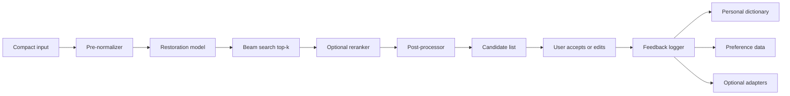

# System Architecture

The target system is modular so the project can compare models and still ship a
demo.

## Logical Flow

## Components

### Pre-Normalizer

Responsibilities:

- Unicode normalization
- whitespace cleanup
- basic Telex/VNI residue hints
- safe input length limits

### Restoration Model

Responsibilities:

- generate standard Vietnamese output
- support top-k candidate generation
- expose model metadata for evaluation

Model selection remains open until benchmarked.

### Reranker

Responsibilities:

- rescore candidates using linguistic naturalness and personalization features
- reduce overcorrection
- protect names, acronyms, brand terms, and code-like spans

### Post-Processor

Responsibilities:

- enforce punctuation and capitalization policy where appropriate
- apply keep-list rules
- normalize final candidate formatting

### Feedback Logger

Responsibilities:

- log accepted, rejected, and edited outputs
- respect consent scope
- produce training data for personalization and preference learning

## Planned Runtime Modes

| Mode | Description |
|---|---|
| Research mode | larger teacher model, quality-oriented |
| Demo mode | server API with top-k response |
| Edge mode | distilled/quantized student, offline or near-offline |
| Personalized mode | dictionary/reranker/adapters enabled for a user |

## Implementation Boundary

The first runnable system should prioritize:

- deterministic API contract
- repeatable evaluation
- stable demo behavior

Production keyboard integration is out of scope for the first implementation.
