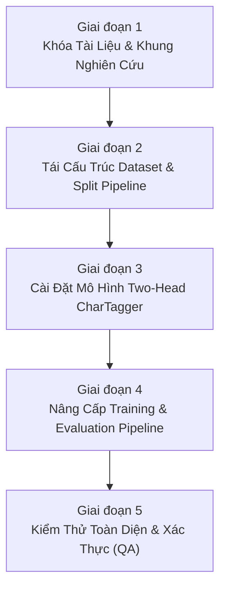

# Kế Hoạch Nâng Cấp Kỹ Thuật NextKey (JDWR v1)

Tài liệu này quy định chi tiết toàn bộ các thay đổi kỹ thuật, sửa lỗi kiến trúc, tái cấu trúc tập dữ liệu và chuẩn hóa quy trình đánh giá cho cột mốc **Joint Diacritic + Whitespace Restoration (JDWR v1)** trên mô hình **Two-Head CharTagger**.

---

## 1. Tóm Tắt Định Hướng Kỹ Thuật

- **Bài toán trọng tâm:** Khôi phục đồng thời dấu thanh tiếng Việt và khoảng trắng từ chuỗi ký tự viết liền không dấu (*Joint Diacritic + Whitespace Restoration*).
- **Kiến trúc phát triển mặc định (Development Default):** **Two-Head CharTagger** (BiGRU Encoder + Character Head + Binary Boundary Head).
- **Chiến lược dữ liệu:** Phân chia 7 In-domains (80/10/10) và cô lập 1 External Domain (`the_thao`) để đo lường độ suy diễn tổng quát (*Domain Generalization*).
- **Chống rò rỉ dữ liệu:** Gom nhóm câu trùng lặp (`compact_key`) trước khi phân chia split.
- **Phạm vi thực hiện:** Tập trung 100% vào JDWR v1; tạm hoãn (*defer*) các bài toán mở rộng (Punctuation, Capitalization, Complex Typo Deletion/Insertion, Personalization) sang các giai đoạn sau.

---

## 2. Chi Tiết Các Hạn Chế / Bug Cũ & Giải Pháp Khắc Phục

### 2.1. Kiến Trúc Mô Hình (Model Architecture)

#### 🔴 Các hạn chế & bug ở phiên bản cũ (`mvp_chartagger.py`)
1. **Bùng nổ không gian nhãn (Label Space Explosion):**
   - Phiên bản cũ gộp nhãn ký tự và dấu cách vào cùng 1 từ vựng (ví dụ: nhãn `"ô"` và nhãn `" ô"` là hai class riêng biệt).
   - *Hệ quả:* Làm tăng số lượng class của bộ phân loại, khiến hai mục tiêu (đoán dấu và đoán ngắt từ) cạnh tranh trực tiếp trong cùng một phép tính Softmax.
2. **Suy giảm chất lượng phân tách từ (Spacing Degradation):**
   - Kết quả thực nghiệm cho thấy `Spacing F1` của CharTagger cũ (0.9776) thấp hơn cả mô hình từ điển Baseline (0.9804).
3. **Nguy cơ hạn chế sửa lỗi gõ phím nếu áp đặt Hard-Constraint:**
   - Nếu ép chặt ký tự đầu vào (ví dụ: ký tự `o` chỉ được sinh ra các biến thể của `o` như `ò, ó, ỏ, õ, ọ, ô, ơ`), mô hình sẽ hoàn toàn mất khả năng sửa lỗi gõ nhầm phím lân cận (như `toidanghpc` $\rightarrow$ `tôi đang học`, `x` $\rightarrow$ `s`).

```text
SƠ ĐỒ KIẾN TRÚC TWO-HEAD CHARTAGGER

            Chuỗi ký tự rút gọn đầu vào (x)
             (vd: "t o i d a n g h o c")
                          │
                          ▼
               Character Embedding (96-d)
                          │
                          ▼
               Bidirectional GRU (192-d)
                          │
            ┌─────────────┴─────────────┐
            ▼                           ▼
     Character Head               Boundary Head
  Linear(hidden*2, Vocab)       Linear(hidden*2, 1)
            │                           │
  Dự đoán ký tự có dấu        Dự đoán cờ ngắt từ
 ("t ô i đ a n g h ọ c")      (0 0 0 1 0 0 0 1 0 0)
            │                           │
            └─────────────┬─────────────┘
                          ▼
               Ghép chuỗi đầu ra (y)
              ("tôi đang học")
```

#### 🟢 Giải pháp kỹ thuật & Thay đổi cần thực hiện
- [ ] **Tách biệt 2 đầu ra độc lập (Two-Head Decomposition):**
  - **Encoder:** Character Embedding + BiGRU hai chiều.
  - **Character Head:** `nn.Linear(hidden_dim * 2, char_vocab_size)` — Dự đoán ký tự tiếng Việt chuẩn tại từng vị trí.
  - **Boundary Head:** `nn.Linear(hidden_dim * 2, 1)` — Dự đoán xác suất nhị phân có dấu cách đứng trước ký tự hiện tại.
- [ ] **Không sử dụng Input Hard-Constraint:**
  - Character Head được tính toán trên toàn bộ từ vựng ký tự tiếng Việt để giữ tính năng sửa lỗi thay thế ký tự (*Keyboard Substitution*).
- [ ] **Hàm mất mát kết hợp (Joint Multi-Task Loss):**
  $$\mathcal{L} = \mathcal{L}_{\text{char}} + \lambda_b \mathcal{L}_{\text{boundary}}$$
  - $\mathcal{L}_{\text{char}}$: `nn.CrossEntropyLoss(ignore_index=pad_char_id)`.
  - $\mathcal{L}_{\text{boundary}}$: `nn.BCEWithLogitsLoss()` áp dụng kèm padding mask.
  - Thiết lập mặc định $\lambda_b = 1.0$.
- [ ] **Cấu trúc biểu diễn dữ liệu mới:**
  - `source`: `toidanghoc`
  - `char_target`: `tôiđanghọc`
  - `boundary_target`: `[0, 0, 0, 1, 0, 0, 0, 1, 0, 0]`

---

### 2.2. Dữ Liệu & Phân Chia Tập Dữ Liệu (Dataset & Splitting Strategy)

#### 🔴 Các hạn chế & bug ở phiên bản cũ (`mvp_dataset.py`, `build_mvp_splits.py`)
1. **Rò rỉ dữ liệu giữa Train và Test (Data Leakage):**
   - Script cũ chia dữ liệu ngẫu nhiên theo `sample_id` (dòng dữ liệu) mà không gom nhóm câu trùng lặp.
   - Các câu phổ biến (ví dụ: các câu khẩu hiệu, mẫu câu tin tức lặp đi lặp lại) xuất hiện đồng thời ở cả tập Train và Dev/Test $\rightarrow$ Kết quả đánh giá bị sai lệch (*optimistic bias*).
2. **Thiếu tập kiểm thử ngoài miền (No External Unseen Test Domain):**
   - 8 chuyên mục tin tức bị trộn lẫn vào nhau. Không đo lường được khả năng tổng quát hóa thực sự khi gặp từ vựng mới lạ ngoài tập huấn luyện.
3. **Mất cân bằng phân phối giữa các miền:**
   - Dữ liệu giữa các domain có độ chênh lệch lớn (từ 74k đến 160k dòng), việc trộn tự do khiến các domain lớn áp đảo hoàn toàn các domain nhỏ.

```text
CHIẾN LƯỢC TỔ CHỨC DỮ LIỆU JDWR v1

  7 In-Domains (chinh_tri, doi_song, kinh_doanh, phap_luat, suc_khoe, the_gioi, van_hoa)
  ┌──────────────────────────────────────────────────────────────────────────────────┐
  │ Mỗi domain được Group theo compact_key(target) -> Băm phân chia độc lập (80/10/10)│
  └──────────────────────────────────────┬───────────────────────────────────────────┘
                                         │
                   ┌─────────────────────┼─────────────────────┐
                   ▼                     ▼                     ▼
              Train Sets             Dev Sets           In-Domain Test Sets
             (7 tệp .jsonl)        (7 tệp .jsonl)          (7 tệp .jsonl)

  1 External Unseen Domain (the_thao) - 160,014 dòng
  ┌──────────────────────────────────────────────────────────────────────────────────┐
  │ Hoàn toàn cô lập (Frozen) -> Không tham gia Train / Dev / Vocab / Early Stopping  │
  └──────────────────────────────────────┬───────────────────────────────────────────┘
                                         ▼
                                 External Test Set
                                 (the_thao.jsonl)
```

#### 🟢 Giải pháp kỹ thuật & Thay đổi cần thực hiện
- [ ] **Cô lập tuyệt đối domain `the_thao` làm External Unseen Test:**
  - `the_thao` chứa nhiều từ vựng đặc thù, tên riêng, thuật ngữ, số liệu thể thao.
  - Tuyệt đối cấm sử dụng `the_thao` cho: xây dựng từ điển/vocab, huấn luyện, chọn mô hình, tinh chỉnh siêu tham số, hoặc early stopping.
- [ ] **Gom nhóm chống rò rỉ dữ liệu (Grouped Deduplication):**
  - Tạo khóa định danh: `group_key = compact_key(target)`.
  - Tất cả các mẫu có cùng `group_key` bắt buộc phải được băm (`hashlib.sha1`) vào cùng một tập split.
- [ ] **Phân chia 7 In-Domain độc lập:**
  - 7 domain: `chinh_tri_xa_hoi`, `doi_song`, `kinh_doanh`, `phap_luat`, `suc_khoe`, `the_gioi`, `van_hoa`.
  - Mỗi domain được chia độc lập theo tỷ lệ cố định: **80% Train / 10% Dev / 10% In-Domain Test**.
- [ ] **Cấu trúc thư mục dữ liệu mới (`data/processed/jdwr_v1/`):**
  ```text
  data/processed/jdwr_v1/
  ├── train/
  │   ├── chinh_tri_xa_hoi.jsonl
  │   ├── doi_song.jsonl
  │   ├── kinh_doanh.jsonl
  │   ├── phap_luat.jsonl
  │   ├── suc_khoe.jsonl
  │   ├── the_gioi.jsonl
  │   └── van_hoa.jsonl
  ├── dev/
  │   ├── chinh_tri_xa_hoi.jsonl
  │   └── ... (7 files)
  ├── test/
  │   ├── in_domain/
  │   │   ├── chinh_tri_xa_hoi.jsonl
  │   │   └── ... (7 files)
  │   └── external/
  │       └── the_thao.jsonl
  └── manifest.json
  ```
- [ ] **Xuất `manifest.json` ghi nhận metadata phân chia:**
  - Lưu version, seed, tỷ lệ split, danh sách domain, số lượng dòng, mã băm kiểm định.

---

### 2.3. Pipeline Huấn Luyện (Training Pipeline)

#### 🔴 Các hạn chế & bug ở phiên bản cũ (`train_mvp_chartagger.py`)
1. **Thiếu hỗ trợ Hardware Acceleration:**
   - Script cũ mặc định chạy CPU hoặc chưa hỗ trợ tự động nhận diện Apple Silicon GPU (`mps`) và NVIDIA GPU (`cuda`).
2. **Padding dư thừa & Tốc độ chậm:**
   - Xử lý các chuỗi batch có độ dài không đều bằng padding tĩnh mà không dùng `pack_padded_sequence` làm lãng phí tính toán trên các token `<pad>`.
3. **Mất cân bằng lấy mẫu miền (Domain Dominance):**
   - Huấn luyện lấy mẫu ngẫu nhiên thuần túy dẫn đến mô hình bị bias theo các miền có lượng dữ liệu lớn.
4. **Quản lý Checkpoint sơ sài:**
   - Chỉ lưu checkpoint ở bước cuối cùng, không theo dõi Dev Loss/CER để lưu mô hình tối ưu nhất (*Best Checkpoint*).

#### 🟢 Giải pháp kỹ thuật & Thay đổi cần thực hiện
- [ ] **Tự động nhận diện thiết bị tính toán:**
  - Hỗ trợ linh hoạt theo thứ tự ưu tiên: `cuda` $\rightarrow$ `mps` $\rightarrow$ `cpu`.
- [ ] **Bộ lấy mẫu cân bằng miền (Domain-Balanced Sampler):**
  - Không cắt bỏ dữ liệu của các miền lớn xuống bằng miền nhỏ nhất.
  - Lấy mẫu đồng đều các miền trong mỗi batch ($P(\text{domain}) = 1/7$) để mô hình tiếp cận các miền với tần suất tương đương.
- [ ] **Tối ưu tốc độ với Packed Sequence & Length Bucketing:**
  - Áp dụng `torch.nn.utils.rnn.pack_padded_sequence` và `pad_packed_sequence` cho BiGRU.
  - Sắp xếp mini-batch theo độ dài chuỗi giảm dần để tối thiểu hóa số lượng token padding.
- [ ] **Cơ chế lưu trữ Checkpoint & Lịch sử huấn luyện:**
  - Tự động đánh giá trên tập `dev` sau mỗi epoch / chu kỳ bước.
  - Lưu trữ checkpoint tốt nhất (`best_model.pt`) dựa trên chỉ số `Dev Loss` và `Dev CER`.
  - Xuất toàn bộ tiến trình học vào tệp `training_history.json`.

---

### 2.4. Khung Đánh Giá & Đo Lường (Evaluation & Reporting)

#### 🔴 Các hạn chế ở phiên bản cũ (`mvp_metrics.py`, `evaluate_mvp_chartagger.py`)
1. **Chỉ số đánh giá chưa phân rã:**
   - Chưa tách bạch giữa độ chính xác khôi phục dấu và độ chính xác phân tách từ.
2. **Thiếu báo cáo phân tách In-domain vs External Domain:**
   - Chưa có cơ chế đo lường mức độ suy giảm hiệu năng khi mô hình gặp miền dữ liệu hoàn toàn mới (*Domain Generalization Gap*).

#### 🟢 Giải pháp kỹ thuật & Thay đổi cần thực hiện
- [ ] **Bổ sung các chỉ số đo lường chuyên biệt:**
  - `Sentence Exact Match`: Tỷ lệ câu phục hồi chính xác 100% cả dấu và khoảng trắng.
  - `Corpus CER` & `Corpus WER`: Tỷ lệ lỗi ký tự và lỗi từ trên toàn bộ tập dữ liệu.
  - `Diacritic Accuracy`: Độ chính xác dự đoán dấu thanh trên các ký tự tương ứng.
  - `Boundary Precision / Recall / F1`: Độ chính xác xác định vị trí ngắt từ (khoảng trắng).
- [ ] **Báo cáo phân tầng chi tiết:**
  - Báo cáo tổng hợp toàn bộ 7 In-Domain Test.
  - Báo cáo chi tiết cho từng domain trong 7 In-Domains.
  - Báo cáo riêng biệt trên External Domain Test (`the_thao`).
- [ ] **Tính toán độ lệch suy diễn tổng quát (Domain Generalization Gap):**
  $$\Delta \text{CER} = \text{CER}_{\text{external}} - \text{CER}_{\text{in-domain}}$$
  $$\Delta \text{Boundary F1} = \text{Boundary F1}_{\text{in-domain}} - \text{Boundary F1}_{\text{external}}$$
- [ ] **Xuất báo cáo định dạng chuẩn:**
  - Tự động xuất kết quả ra `metrics.in_domain.json`, `metrics.external.json`, `metrics_by_domain.json`, và bảng tổng hợp `report.md`.

---

## 3. Bảng Phân Công Tệp Tin Cần Sửa Đổi (File-by-File Task Matrix)

| STT | Đường Dẫn Tệp Tin | Mục Đích & Nội Dung Cần Thay Đổi |
|:---:|---|---|
| 1 | [`docs/00-project/research-contract.md`](file:///Volumes/WorkSpace/Project/NextKey/docs/00-project/research-contract.md) | Khóa bài toán trọng tâm JDWR v1; bổ sung câu hỏi nghiên cứu (RQ) về Domain Generalization; định vị Two-Head CharTagger làm Development Default. |
| 2 | [`docs/02-model/model-selection.md`](file:///Volumes/WorkSpace/Project/NextKey/docs/02-model/model-selection.md) | Chuyển trạng thái model selection sang chốt Two-Head BiGRU là mô hình phát triển chính; định vị Teacher model (ByT5/ViT5) làm ngưỡng trần chất lượng sau này. |
| 3 | [`docs/01-data/dataset-build-plan.md`](file:///Volumes/WorkSpace/Project/NextKey/docs/01-data/dataset-build-plan.md) | Cập nhật quy trình chia 7 in-domain (80/10/10) + 1 external holdout (`the_thao`); mô tả chi tiết thuật toán gom nhóm chống rò rỉ dữ liệu. |
| 4 | [`docs/03-evaluation/evaluation-plan.md`](file:///Volumes/WorkSpace/Project/NextKey/docs/03-evaluation/evaluation-plan.md) | Định nghĩa bộ chỉ số mới: Boundary P/R/F1, Corpus CER/WER, Diacritic Acc; quy định đo lường Domain Generalization Gap. |
| 5 | [`src/nextkey/data/mvp_dataset.py`](file:///Volumes/WorkSpace/Project/NextKey/src/nextkey/data/mvp_dataset.py) | Viết lại bộ nạp và phân tách dữ liệu đa miền, tạo nhãn kép (`char_target`, `boundary_target`), băm gom nhóm `compact_key`, và xuất `manifest.json`. |
| 6 | [`src/nextkey/models/mvp_chartagger.py`](file:///Volumes/WorkSpace/Project/NextKey/src/nextkey/models/mvp_chartagger.py) | Xây dựng lớp Two-Head CharTagger (BiGRU + Char Head + Binary Boundary Head), bộ mã hóa từ vựng ký tự độc lập, và decoder ghép chuỗi. |
| 7 | [`src/nextkey/evaluation/mvp_metrics.py`](file:///Volumes/WorkSpace/Project/NextKey/src/nextkey/evaluation/mvp_metrics.py) | Thêm các hàm tính Boundary Precision, Recall, F1, Corpus-level CER/WER, Diacritic Accuracy, và quản lý đối tượng `MetricTotals`. |
| 8 | [`scripts/build_mvp_splits.py`](file:///Volumes/WorkSpace/Project/NextKey/scripts/build_mvp_splits.py) | Cập nhật CLI script phân chia tập dữ liệu mới sang `data/processed/jdwr_v1/` theo cấu trúc thư mục domain-aware. |
| 9 | [`scripts/train_mvp_chartagger.py`](file:///Volumes/WorkSpace/Project/NextKey/scripts/train_mvp_chartagger.py) | Tích hợp nhận diện phần cứng (`cuda`/`mps`/`cpu`), Packed BiGRU, Domain-balanced Sampler, Multi-task Loss, và lưu Best Checkpoint. |
| 10 | [`scripts/evaluate_mvp_chartagger.py`](file:///Volumes/WorkSpace/Project/NextKey/scripts/evaluate_mvp_chartagger.py) | Cập nhật script đánh giá xuất báo cáo đa tầng: tổng thể In-domain, chi tiết từng In-domain, External Domain, và tính toán Generalization Gap. |
| 11 | [`configs/data/mvp_feasibility.yaml`](file:///Volumes/WorkSpace/Project/NextKey/configs/data/mvp_feasibility.yaml) | Cập nhật danh sách 7 in-domains, cấu hình external domain `the_thao`, tỷ lệ 80/10/10, và đường dẫn xuất `data/processed/jdwr_v1`. |
| 12 | [`configs/model/mvp_chartagger_v1.yaml`](file:///Volumes/WorkSpace/Project/NextKey/configs/model/mvp_chartagger_v1.yaml) | Cập nhật tham số Two-Head model, trọng số loss $\lambda_b$, batch size, learning rate, và cơ chế validation định kỳ. |
| 13 | [`tests/test_cli_scaffold.py`](file:///Volumes/WorkSpace/Project/NextKey/tests/test_cli_scaffold.py) | Bổ sung unit tests kiểm tra: 0% data leakage giữa các split, tính đúng đắn của 2 đầu ra Two-Head model, và tính nhất quán của metrics. |

---

## 4. Lộ Trình Thực Thi 5 Giai Đoạn (Execution Plan)



### 🔹 Giai đoạn 1: Khóa Tài Liệu & Hợp Đồng Nghiên Cứu
1. Cập nhật [`research-contract.md`](file:///Volumes/WorkSpace/Project/NextKey/docs/00-project/research-contract.md) và [`model-selection.md`](file:///Volumes/WorkSpace/Project/NextKey/docs/02-model/model-selection.md).
2. Thiết lập mục tiêu bài toán rõ ràng: Joint Diacritic + Whitespace Restoration.
3. Bổ sung câu hỏi nghiên cứu về Domain Generalization.

### 🔹 Giai đoạn 2: Tái Cấu Trúc Dataset & Tạo Split Chống Rò Rỉ
1. Chỉnh sửa [`mvp_dataset.py`](file:///Volumes/WorkSpace/Project/NextKey/src/nextkey/data/mvp_dataset.py) và [`build_mvp_splits.py`](file:///Volumes/WorkSpace/Project/NextKey/scripts/build_mvp_splits.py).
2. Thực thi cô lập `the_thao` làm External Test.
3. Phân chia 7 In-domains theo tỷ lệ 80/10/10 với thuật toán Grouped Deduplication (`compact_key`).
4. Xuất dữ liệu ra `data/processed/jdwr_v1/` và tạo `manifest.json`.

### 🔹 Giai đoạn 3: Cài Đặt Mô Hình Two-Head CharTagger
1. Chỉnh sửa [`mvp_chartagger.py`](file:///Volumes/WorkSpace/Project/NextKey/src/nextkey/models/mvp_chartagger.py).
2. Cài đặt lớp mạng BiGRU với 2 đầu ra: `char_head` và `boundary_head`.
3. Xây dựng bộ mã hóa nhãn kép (`char_targets`, `boundary_targets`) và thuật toán giải mã khôi phục câu văn.
4. Cài đặt hàm mất mát kết hợp `MultiTaskLoss` với hệ số cân bằng $\lambda_b$.

### 🔹 Giai đoạn 4: Nâng Cấp Pipeline Huấn Luyện & Đánh Giá
1. Chỉnh sửa [`train_mvp_chartagger.py`](file:///Volumes/WorkSpace/Project/NextKey/scripts/train_mvp_chartagger.py):
   - Thêm tự động nhận diện `cuda` / `mps` / `cpu`.
   - Cài đặt `DomainBalancedBatchSampler` và `PackedSequence`.
   - Thêm cơ chế lưu `best_model.pt` và ghi log `training_history.json`.
2. Chỉnh sửa [`mvp_metrics.py`](file:///Volumes/WorkSpace/Project/NextKey/src/nextkey/evaluation/mvp_metrics.py) và [`evaluate_mvp_chartagger.py`](file:///Volumes/WorkSpace/Project/NextKey/scripts/evaluate_mvp_chartagger.py):
   - Thêm tính toán Boundary Precision/Recall/F1, Corpus CER/WER, Diacritic Accuracy.
   - Xuất báo cáo so sánh In-Domain Test vs External Test.

### 🔹 Giai đoạn 5: Kiểm Thử Toàn Diện & Đảm Bảo Chất Lượng (QA)
1. Cập nhật và bổ sung unit tests trong [`tests/test_cli_scaffold.py`](file:///Volumes/WorkSpace/Project/NextKey/tests/test_cli_scaffold.py).
2. Kiểm tra tính toàn vẹn dữ liệu: Đảm bảo 0% trùng lặp `group_key` giữa các tập split, 0 dòng `the_thao` trong train/dev.
3. Chạy kiểm thử tự động với `pytest` đảm bảo toàn bộ hệ thống hoạt động chính xác.
